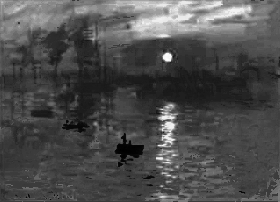
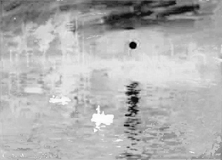
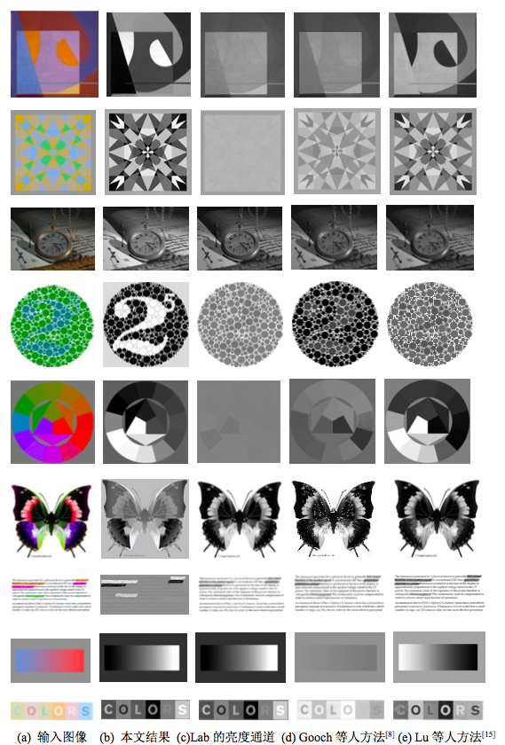

图像灰度化  Image Grayscale
====

本文的图像灰度化实现主要基于：

1. Data-driven Color Manifolds [Nguyen et al. 2015].
2. Color-to-gray conversion using ISOMAP [Cui et al. 2010].
3. 一种快速映射Isomap算法 [圣少友 et al. 2009].

灰度化结果
===

#### 输入图像：

#### 输出图像：

#### 所有结果：

感谢
===

项目中采用Nguyen等人的论文实现，基于以下开源项目：
[https://github.com/tody411/SOM-ColorManifolds](https://github.com/tody411/SOM-ColorManifolds)

## License

The MIT License 2017 (c) tody